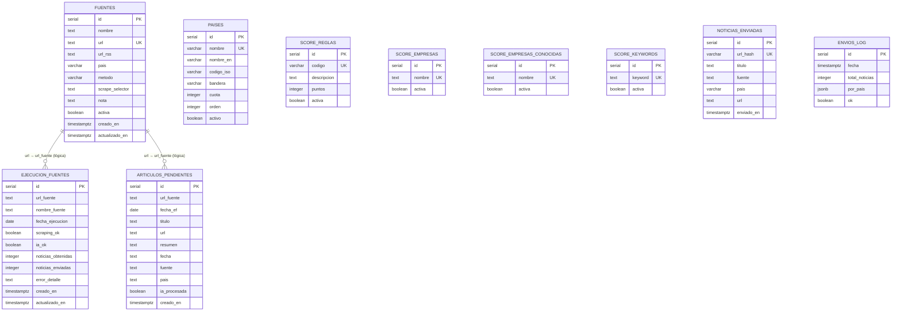

# Modelo de Datos — RPA Boletín Minero-Energético

> **Versión**: 3.0 · Abril 2026
> Refleja el schema real de `db.py` (función `init_db()`).
> Actualizado para incluir `articulos_pendientes`, `score_empresas_conocidas` y las columnas reales de todas las tablas.

---

## Diagrama Entidad-Relación



> Las FK son lógicas (no declaradas con FOREIGN KEY en el DDL) para simplificar la operación. La integridad se garantiza a nivel de aplicación.

---

## Diccionario de Datos Detallado

### 1. Tabla: `fuentes`

Catálogo de fuentes de noticias. Reemplaza `sources.py`. Agregar o desactivar una fuente no requiere modificar código.

| Campo | Tipo | PK/UK | Obligatorio | Default | Descripción |
|-------|------|-------|-------------|---------|-------------|
| id | SERIAL | PK | ✓ | AUTO | Identificador interno. No se usa como FK — las referencias usan `url`. |
| nombre | TEXT | — | ✓ | — | Nombre legible de la fuente, ej: "Minería Chilena (MCH)". |
| url | TEXT | UK | ✓ | — | URL base del sitio. Clave de negocio: se referencia en `ejecucion_fuentes` y `articulos_pendientes`. |
| url_rss | TEXT | — | — | NULL | URL del feed RSS. NULL indica que la fuente usa scraping con selector CSS. |
| pais | VARCHAR(50) | — | ✓ | — | País: `Chile` \| `Peru` \| `Argentina` \| `Internacional`. Determina la cuota geográfica del boletín. |
| metodo | VARCHAR(10) | — | ✓ | — | `rss` (via feedparser) o `scrape` (via httpx+BeautifulSoup). CHECK(metodo IN('rss','scrape')). |
| scrape_selector | TEXT | — | — | NULL | Selector CSS para extraer titulares. Solo aplica cuando `metodo='scrape'`. |
| nota | TEXT | — | — | NULL | Comentario libre, ej: "Paywall parcial". No afecta lógica. |
| activa | BOOLEAN | — | ✓ | TRUE | FALSE desactiva la fuente sin borrarla. El pipeline solo procesa fuentes activas. |
| creado_en | TIMESTAMPTZ | — | ✓ | NOW() | Timestamp de creación. Solo informativo. |
| actualizado_en | TIMESTAMPTZ | — | ✓ | NOW() | Timestamp de última modificación. Solo informativo. |

**Índices:** `idx_fuentes_activa (activa)`, `idx_fuentes_pais (pais)`

**Lógica de negocio:** Solo fuentes con `activa=TRUE` son procesadas. `metodo` controla la rama del scraping. `pais` determina qué cuota aplica en la selección final.

---

### 2. Tabla: `paises`

Define qué países participan en el boletín, cuántas noticias incluye cada uno y en qué orden aparecen.

| Campo | Tipo | PK/UK | Obligatorio | Default | Descripción |
|-------|------|-------|-------------|---------|-------------|
| id | SERIAL | PK | ✓ | AUTO | Identificador interno. |
| nombre | VARCHAR(100) | UK | ✓ | — | Nombre en español, ej: "Chile". Debe coincidir con `fuentes.pais`. |
| nombre_en | VARCHAR(100) | — | ✓ | — | Nombre en inglés para la columna derecha del boletín bilingüe. |
| codigo_iso | VARCHAR(3) | — | ✓ | — | Código ISO 3166-1 alpha-3, ej: `CHL`. |
| bandera | VARCHAR(10) | — | ✓ | — | Emoji de bandera, ej: 🇨🇱. Se usa en el HTML del boletín. |
| cuota | INTEGER | — | ✓ | 10 | Máximo de noticias de este país en cada boletín. CHECK(cuota > 0). |
| orden | INTEGER | — | ✓ | 99 | Posición del país en el boletín (1 = primero). Controla el orden visual de secciones. |
| activo | BOOLEAN | — | ✓ | TRUE | FALSE excluye el país sin perder su cuota configurada. |

**Índices:** `idx_paises_activo (activo)`, `idx_paises_orden (orden)`

**Lógica de negocio:** Si un país no tiene suficientes noticias para cubrir su cuota, el déficit se rellena con fuentes Internacionales. Para agregar un país nuevo: `INSERT INTO paises ...` — el próximo boletín ya lo incluye automáticamente.

---

### 3. Tabla: `score_reglas`

Pesos del sistema de scoring. Editables desde la DB sin modificar código. `scorer.py` lee estos valores en cada ejecución.

| Campo | Tipo | PK/UK | Obligatorio | Default | Descripción |
|-------|------|-------|-------------|---------|-------------|
| id | SERIAL | PK | ✓ | AUTO | Identificador interno. |
| codigo | VARCHAR(50) | UK | ✓ | — | Clave usada por `scorer.py`: `contrato`, `empresa_conocida`, `empresa_noticia`, `reciente_3dias`, `reciente_hoy`. |
| descripcion | TEXT | — | ✓ | — | Explicación legible del criterio. Solo informativa. |
| puntos | INTEGER | — | ✓ | — | Puntos que suma este criterio al score de una noticia. |
| activa | BOOLEAN | — | ✓ | TRUE | FALSE desactiva la regla sin borrarla. |

**Valores iniciales (seed):**

| codigo | puntos | Descripción |
|--------|--------|-------------|
| contrato | 250 | Noticia de contrato / licitación / adjudicación |
| empresa_conocida | 150 | Contrato que involucra empresa conocida del sector |
| empresa_noticia | 80 | Noticia relevante de empresa importante (sin contrato) |
| reciente_3dias | 60 | Noticia publicada hace 3 días o menos |
| reciente_hoy | 25 | Noticia publicada hoy (se suma a reciente_3dias) |

---

### 4. Tabla: `score_empresas`

Lista de empresas que suman puntos si aparecen en el título o resumen de una noticia, independientemente de si hay contrato o no.

| Campo | Tipo | PK/UK | Obligatorio | Default | Descripción |
|-------|------|-------|-------------|---------|-------------|
| id | SERIAL | PK | ✓ | AUTO | Identificador interno. |
| nombre | TEXT | UK | ✓ | — | Nombre de empresa. Si aparece en el texto, suma `score_reglas.empresa_noticia` (+80 pts). |
| activa | BOOLEAN | — | ✓ | TRUE | FALSE desactiva la empresa sin borrarla. |

**Nota:** Distinta de `score_empresas_conocidas` (ver §5). Una empresa puede estar en ambas tablas.

---

### 5. Tabla: `score_empresas_conocidas`

Lista de empresas que activan el bonus `empresa_conocida` SOLO cuando la noticia ya detectó una palabra clave de contrato/licitación. Implementa la regla: `contrato AND empresa conocida = +150 pts adicionales`.

| Campo | Tipo | PK/UK | Obligatorio | Default | Descripción |
|-------|------|-------|-------------|---------|-------------|
| id | SERIAL | PK | ✓ | AUTO | Identificador interno. |
| nombre | TEXT | UK | ✓ | — | Empresa que activa el bonus solo en contexto de contrato. |
| activa | BOOLEAN | — | ✓ | TRUE | FALSE desactiva la empresa sin borrarla. |

**Lógica de negocio:** El bonus solo aplica cuando `tiene_contrato=TRUE` (keyword detectado) Y la empresa está en esta tabla. Una empresa en ambas tablas puede acumular: `empresa_noticia (+80) + empresa_conocida (+150)` en una sola noticia de contrato.

---

### 6. Tabla: `score_keywords`

Palabras clave que identifican noticias de contratos, licitaciones o adjudicaciones.

| Campo | Tipo | PK/UK | Obligatorio | Default | Descripción |
|-------|------|-------|-------------|---------|-------------|
| id | SERIAL | PK | ✓ | AUTO | Identificador interno. |
| keyword | TEXT | UK | ✓ | — | Palabra clave. La detección es case-insensitive. Activa el criterio `contrato` (+250 pts). |
| activa | BOOLEAN | — | ✓ | TRUE | FALSE desactiva el keyword sin borrarlo. |

**Ejemplos de keywords seed:** `contrato`, `licitación`, `adjudicación`, `EPC`, `EPCM`, `concesión`, `award`, `contract`, `tender`, `bid`.

---

### 7. Tabla: `noticias_enviadas`

Historial permanente de URLs incluidas en boletines. El pipeline consulta esta tabla para garantizar que ninguna noticia se envíe dos veces.

| Campo | Tipo | PK/UK | Obligatorio | Default | Descripción |
|-------|------|-------|-------------|---------|-------------|
| id | SERIAL | PK | ✓ | AUTO | Identificador interno. |
| url_hash | VARCHAR(64) | UK | ✓ | — | SHA-256 de la URL normalizada (strip). Clave de deduplicación O(1). |
| titulo | TEXT | — | ✓ | — | Título de la noticia. Solo informativo. |
| fuente | TEXT | — | ✓ | — | Nombre de la fuente. Solo informativo. |
| pais | VARCHAR(50) | — | ✓ | — | País de origen. Solo informativo. |
| url | TEXT | — | ✓ | — | URL original. Solo informativo. |
| enviado_en | TIMESTAMPTZ | — | ✓ | NOW() | Fecha y hora exacta del envío. |

**Índices:** `idx_ne_url_hash (url_hash)`, `idx_ne_enviado_en (enviado_en)`

**Lógica de negocio:** El historial es permanente — no se purga automáticamente. Si una URL ya existe en `url_hash`, se descarta antes de llegar al scorer.

---

### 8. Tabla: `ejecucion_fuentes`

Tabla central de control de reintentos. Registra el estado de procesamiento de cada fuente para cada fecha efectiva. Garantiza idempotencia ante múltiples ejecuciones del mismo día.

| Campo | Tipo | PK/UK | Obligatorio | Default | Descripción |
|-------|------|-------|-------------|---------|-------------|
| id | SERIAL | PK | ✓ | AUTO | Identificador interno. |
| url_fuente | TEXT | UK* | ✓ | — | URL de la fuente (FK lógica a `fuentes.url`). *UK compuesta con `fecha_ejecucion`. |
| nombre_fuente | TEXT | — | ✓ | — | Nombre de la fuente cacheado para evitar JOINs en reporting. |
| fecha_ejecucion | DATE | UK* | ✓ | — | Fecha efectiva del día autorizado (mar/jue). No es la fecha real de ejecución. *UK compuesta con `url_fuente`. |
| scraping_ok | BOOLEAN | — | ✓ | FALSE | TRUE cuando el scraping completó sin error. |
| ia_ok | BOOLEAN | — | ✓ | FALSE | TRUE cuando Claude procesó exitosamente los artículos. Solo TRUE implica cobro real a la API. |
| noticias_obtenidas | INTEGER | — | ✓ | 0 | Artículos extraídos en scraping. Solo informativo. |
| noticias_enviadas | INTEGER | — | ✓ | 0 | Artículos incluidos en el boletín. Solo informativo. |
| error_detalle | TEXT | — | — | NULL | Detalle del error si algún flag es FALSE. |
| creado_en | TIMESTAMPTZ | — | ✓ | NOW() | Timestamp de creación. |
| actualizado_en | TIMESTAMPTZ | — | ✓ | NOW() | Timestamp de última actualización (upsert). |

**Índices:** `idx_ef_fecha (fecha_ejecucion)`, `idx_ef_url_fecha (url_fuente, fecha_ejecucion)`

**Lógica de negocio:**
- Una fuente está completa solo cuando `scraping_ok=TRUE AND ia_ok=TRUE`.
- Si `scraping_ok=FALSE`: se reintenta completa (scraping + IA).
- Si `scraping_ok=TRUE AND ia_ok=FALSE`: pasa a modo **solo-IA** — se recuperan artículos de `articulos_pendientes` sin re-scrapear.
- `fecha_ejecucion` es la fecha efectiva (último mar/jue), no la fecha real de ejecución.

---

### 9. Tabla: `envios_log`

Registra cada intento de envío del boletín. Usa JSONB para el conteo por país, permitiendo agregar países sin modificar el schema.

| Campo | Tipo | PK/UK | Obligatorio | Default | Descripción |
|-------|------|-------|-------------|---------|-------------|
| id | SERIAL | PK | ✓ | AUTO | Identificador interno. |
| fecha | TIMESTAMPTZ | — | ✓ | NOW() | Timestamp exacto del envío. No es PK por fecha — permite registrar reintentos. |
| total_noticias | INTEGER | — | ✓ | — | Total de noticias incluidas en el boletín. |
| por_pais | JSONB | — | ✓ | '{}' | Conteo por país en formato JSON, ej: `{"Chile":10,"Peru":8,"Argentina":7}`. Flexible para cualquier número de países. |
| ok | BOOLEAN | — | ✓ | TRUE | FALSE si el envío SMTP falló. |

**Lógica de negocio:** `ok=FALSE` indica que el boletín no llegó a los destinatarios. No tiene PK única por fecha efectiva para permitir múltiples registros en caso de reintentos.

---

### 10. Tabla: `articulos_pendientes`

Tabla de staging temporal. Almacena artículos scrapeados pendientes de procesamiento por la IA. Habilita el reintento solo-IA: si el scraping fue exitoso pero la API falló, la siguiente ejecución recupera los artículos de aquí sin re-scrapear.

| Campo | Tipo | PK/UK | Obligatorio | Default | Descripción |
|-------|------|-------|-------------|---------|-------------|
| id | SERIAL | PK | ✓ | AUTO | Identificador interno. |
| url_fuente | TEXT | — | ✓ | — | URL de la fuente (FK lógica a `fuentes.url`). Usada para recuperar artículos por fuente. |
| fecha_ef | DATE | UK* | ✓ | — | Fecha efectiva del boletín. *UK compuesta con `url`. |
| titulo | TEXT | — | ✓ | — | Título del artículo. |
| url | TEXT | UK* | ✓ | — | URL del artículo. *UK compuesta con `fecha_ef`. |
| resumen | TEXT | — | — | NULL | Resumen o extracto. Puede ser NULL. |
| fecha | TEXT | — | — | NULL | Fecha de publicación como texto (formato variable según fuente). |
| fuente | TEXT | — | — | NULL | Nombre de la fuente (redundante, evita JOIN al recuperar). |
| pais | TEXT | — | — | NULL | País de la fuente (redundante, evita JOIN al recuperar). |
| ia_procesada | BOOLEAN | — | ✓ | FALSE | TRUE cuando Claude procesó exitosamente este artículo. Se marca inmediatamente tras cada respuesta válida, **antes** de limpiar la tabla. Garantiza cero doble cobro aunque `limpiar_articulos_pendientes` falle. |
| creado_en | TIMESTAMPTZ | — | ✓ | NOW() | Timestamp de inserción. Los registros se eliminan tras un envío exitoso. |

**Índices:** `idx_ap_fuente_fecha (url_fuente, fecha_ef)`

**Lógica de negocio:**
- Los artículos se insertan inmediatamente tras un scraping exitoso (`ON CONFLICT DO NOTHING`).
- `get_articulos_pendientes` solo retorna registros con `ia_procesada=FALSE`.
- `ia_procesada=TRUE` se establece en `scorer.py` justo después de cada respuesta válida de Claude.
- Los registros se eliminan tras un envío exitoso (`limpiar_articulos_pendientes`). Si esa limpieza falla, `ia_procesada=TRUE` protege contra doble cobro.
- `UNIQUE(url, fecha_ef)` previene duplicados si el pipeline se ejecuta varias veces el mismo día.

---

## Relaciones Principales

| Desde | Campo | Hacia | Tipo |
|-------|-------|-------|------|
| `ejecucion_fuentes.url_fuente` | → | `fuentes.url` | FK lógica (1:N) |
| `articulos_pendientes.url_fuente` | → | `fuentes.url` | FK lógica (1:N) |
| `noticias_enviadas.url_hash` | SHA-256(url) | — | Deduplicación |
| `paises.nombre` | = | `fuentes.pais` | Referencia lógica |
| `score_reglas.codigo` | → | scorer.py | Leída por código |

---

## Reglas de Integridad a Nivel de Aplicación

```
-- Una fuente está completa solo si:
scraping_ok = TRUE AND ia_ok = TRUE

-- El modo solo-IA se activa cuando:
scraping_ok = TRUE AND ia_ok = FALSE

-- Los artículos pendientes seguros de recuperar son:
ia_procesada = FALSE

-- Una noticia no se incluye si:
SHA256(url) EXISTS IN noticias_enviadas.url_hash

-- Las cuotas se aplican desde:
paises WHERE activo = TRUE ORDER BY orden ASC
```

---

## Scripts de Referencia

```sql
-- Agregar un país nuevo al boletín
INSERT INTO paises (nombre, nombre_en, codigo_iso, bandera, cuota, orden)
VALUES ('Colombia', 'Colombia', 'COL', '🇨🇴', 10, 4);

-- Cambiar la cuota de un país
UPDATE paises SET cuota = 15 WHERE nombre = 'Chile';

-- Desactivar una fuente temporalmente
UPDATE fuentes SET activa = FALSE WHERE url = 'https://www.ejemplo.com';

-- Ver estado de fuentes en la última ejecución
SELECT url_fuente, nombre_fuente, scraping_ok, ia_ok, noticias_obtenidas, error_detalle
FROM ejecucion_fuentes
WHERE fecha_ejecucion = (SELECT MAX(fecha_ejecucion) FROM ejecucion_fuentes)
ORDER BY scraping_ok, ia_ok;

-- Ver artículos pendientes de IA por fuente
SELECT url_fuente, COUNT(*) as pendientes
FROM articulos_pendientes
WHERE ia_procesada = FALSE
GROUP BY url_fuente;

-- Cambiar el peso de un criterio de scoring
UPDATE score_reglas SET puntos = 300 WHERE codigo = 'contrato';
```
